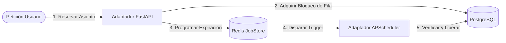

# Sistema de Reservas de Alta Concurrencia

[](https://www.python.org/)
[](https://fastapi.tiangolo.com/)
[](https://apscheduler.readthedocs.io/)
[]()

Un servicio de backend de nivel de producción diseñado para plataformas de venta de boletos en vivo (estilo TicketMaster) enfocado en resolver el problema del **"inventario fantasma"**. Este sistema gestiona el bloqueo de asientos en tiempo real con protección de alta concurrencia y garantiza la liberación resiliente de los carritos abandonados tras una ventana estricta de 8 minutos.

---

## 🚀 Desafíos de Ingeniería Resueltos

*   **Arquitectura Hexagonal (Puertos y Adaptadores):** Separación absoluta entre la lógica pura del negocio (dominio) y las dependencias de infraestructura (FastAPI, SQLAlchemy, APScheduler).
*   **Inmunidad a Condiciones de Carrera (Race Conditions):** Implementación de **Bloqueo Pesimista (`SELECT FOR UPDATE`)** a nivel de base de datos. Esto asegura que bajo ráfagas masivas de tráfico en un evento de alta demanda, un mismo asiento nunca pueda ser reservado por dos usuarios en el mismo milisegundo.
*   **Programación Dinámica Resiliente:** Desarrollado con `APScheduler` utilizando un `RedisJobStore` persistente. Si la aplicación se cae o se reinicia, las tareas de liberación pendientes **no se pierden** y reanudan su ejecución de forma segura al arrancar mediante configuraciones de `misfire_grace_time`.
*   **Workers de Expiración Idempotentes:** El proceso de liberación en segundo plano re-valida el estado real de la orden en la base de datos antes de modificar el inventario, previniendo errores por pagos de último segundo.

---

## 🛠️ Stack Tecnológico

*   **Core:** Python 3.11+ / FastAPI (API REST Asíncrona)
*   **Manejo de Tareas:** APScheduler (`AsyncIOScheduler`)
*   **Base de Datos y ORM:** PostgreSQL / SQLAlchemy (Engine Asíncrono)
*   **Estado Distribuido y JobStore:** Redis
*   **Contenedores:** Docker / Docker Compose

---

## 📐 Vista General de la Arquitectura

El sistema desacopla los casos de uso principales de las herramientas de terceros. Para un desglose exhaustivo del refinamiento técnico, las historias de usuario y los criterios de aceptación detallados, por favor visita la [Documentación de Refinamiento Técnico](./docs/refinamiento.md).

```text
src/
├── domain/                  # Modelos de Dominio Puros y Lógica de Negocio
    ├── interfaces/                   # Interfaces de Entrada y Salida (Clases Abstractas)
├── application/               # Comandos de la Aplicación (Reservar, Pagar, Expirar)
└── infrastructure/          # Controladores (FastAPI), Adaptadores (PostgreSQL, Redis, APScheduler)
```

---

## 📝 Flujo de Ciclo de Vida del Asiento



---

## 📝 Documentation Adicional

Para un análisis detallado del diseño de concurrencia en la base de datos, decisiones de arquitectura y diagramas de secuencia de Mermaid que muestran el comportamiento ante fallas del sistema, consulta el archivo principal de **[Refinamiento Técnico](./docs/refinamiento.md)**.