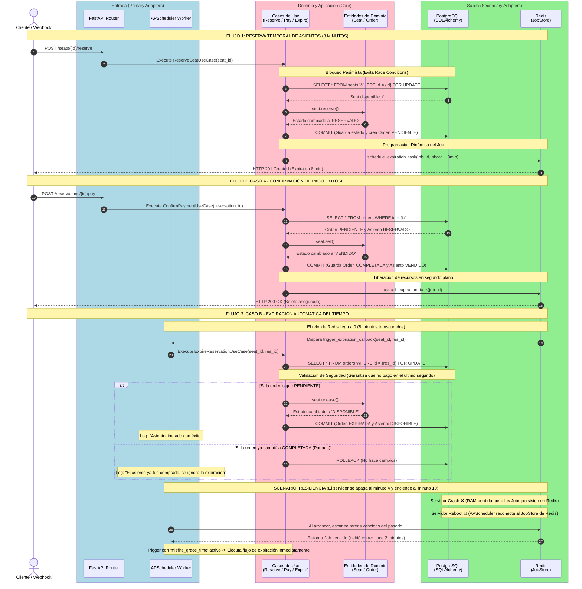

# Ghost Inventory: Sistema de Reservas y Liberación de Inventario Expirado

Este proyecto implementa el backend crítico para un sistema de venta de boletos en vivo, enfocado en resolver el problema del **inventario fantasma**. Utiliza un mecanismo dinámico en segundo plano para garantizar que los asientos apartados por usuarios que abandonan el proceso de compra sean liberados automáticamente, manteniendo el stock real siempre disponible.

---

## 1. Historias de Usuario y Criterios de Aceptación

### Historia de Usuario 1: Apartado Temporal de Asientos
> **Como** Usuario del sistema,  
> **Quiero** seleccionar un asiento y que se reserve temporalmente,  
> **Para** asegurar mis boletos mientras ingreso mis datos de pago sin que otro usuario los gane.

*   **Criterio de Aceptación 1.1:** Cuando un usuario selecciona un asiento con estado `DISPONIBLE`, el sistema debe cambiar su estado a `RESERVADO` y generar una orden en estado `PENDIENTE`.
*   **Criterio de Aceptación 1.2:** El sistema debe iniciar un temporizador de cuenta regresiva de **8 minutos**. Durante este periodo, ningún otro usuario podrá seleccionar ni reservar este asiento.
*   **Criterio de Aceptación 1.3:** La API debe responder con el ID de la reserva y el timestamp exacto (`ISO 8601`) de la expiración.

### Historia de Usuario 2: Confirmación por Pago Exitoso
> **Como** Sistema de Reservas,  
> **Quiero** procesar la confirmación del pago de una orden,  
> **Para** consolidar la compra del asiento de forma permanente.

*   **Criterio de Aceptación 2.1:** Si se recibe la confirmación de pago exitoso (`PAGADO`) dentro del límite de los 8 minutos, el estado del asiento debe cambiar permanentemente a `VENDIDO` y la orden a `COMPLETADA`.
*   **Criterio de Aceptación 2.2:** El temporizador de expiración en segundo plano asociado a esa reserva debe ser cancelado inmediatamente para liberar recursos del sistema.

### Historia de Usuario 3: Liberación por Expiración de Tiempo
> **Como** Organizador del Evento,  
> **Quiero** que los asientos no pagados se liberen automáticamente tras 8 minutos,  
> **Para** maximizar la venta de boletos y garantizar un inventario saludable.

*   **Criterio de Aceptación 3.1:** Si transcurren los 8 minutos y la orden asociada sigue en estado `PENDIENTE`, el sistema debe cambiar el estado del asiento de vuelta a `DISPONIBLE` y la orden a `EXPIRADA`.
*   **Criterio de Aceptación 3.2:** El sistema debe ser **resiliente**: si la aplicación se reinicia o se cae, las tareas de liberación pendientes almacenadas en el JobStore persistente deben reanudarse y ejecutarse correctamente al volver a encender el servicio.

---

## 2. Refinamiento Técnico y Arquitectura Hexagonal

Para este sistema se aplica **Arquitectura Hexagonal (Ports & Adapters)**. El dominio (reglas de negocio para reservar, pagar y expirar) es completamente puro y no sabe de la existencia de FastAPI, PostgreSQL o APScheduler. La infraestructura interactúa con el dominio únicamente a través de **Puertos** (Interfaces).

### Diagrama de Arquitectura e Interacción (Mermaid)

---

## 3. Stack Tecnológico

* **Lenguaje:** Python 3.11+
* **Framework API:** FastAPI (Manejo asíncrono nativo de alta velocidad).
* **Programador de Tareas:** APScheduler (AsyncIOScheduler para integrarse al event loop de FastAPI).
* **Base de Datos Relacional:** PostgreSQL (Garantiza consistencia transaccional ACID).
* **Persistencia de Tareas:** Redis (Utilizado como RedisJobStore para APScheduler; si el servidor se cae, las tareas no se pierden ya que residen en memoria persistente de Redis).
* **ORM:** SQLAlchemy + Alembic (Para interactuar asíncronamente con la BD y gestionar migraciones).